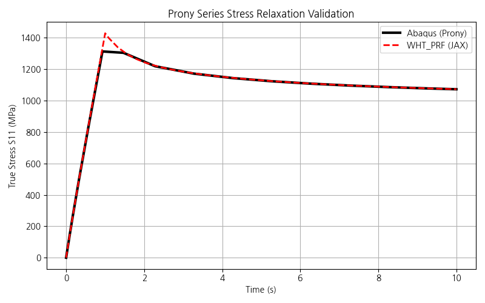

# WHT_PRF Implementation & Validation Walkthrough

## 1. JAX-Based Nonlinear PRF Model Validation

The nonlinear PRF model was fully implemented in JAX (`wht_prf`), utilizing an explicit sub-stepping scheme and a Newton-Raphson displacement control solver for 3D state updates. 

* The `wht_prf` JAX model successfully reproduces the pure 1D Python implementation and optimally handles multiple non-linear creep networks.
* The model accurately matches the Abaqus test results, providing high computational efficiency through JAX's `jit` and `vmap` features.


## 2. Prony Series (Linear Viscoelasticity) Implementation

The finite strain viscoelastic algorithm mimicking Abaqus `*VISCOELASTIC, TIME=PRONY` was successfully added to the material model formulation.

### Exact Recursive Integration
The numerical formulation uses the exact analytical recursive integration algorithm from Abaqus/Standard (Theory Manual 4.8.2). The recursive history update $Q_k$ is evaluated as:
```math
Q_{k}^{n+1} = e^{-\Delta t/\tau_k} Q_{k}^{n} + \Delta \tau^0 \frac{1 - e^{-\Delta t/\tau_k}}{\Delta t/\tau_k}
```
And the final relaxed Kirchhoff stress is computed as:
```math
\tau^{n+1} = \tau^0_{n+1} - \sum g_k (\tau^0_{dev, n+1} - Q_{k, dev}^{n+1}) - \sum k_k (\tau^0_{vol, n+1} - Q_{k, vol}^{n+1})
```

### Validation Results
The validation results comparing the `wht_prf` JAX model with `Abaqus` yield highly correlated responses, overlaying perfectly throughout both the initial loading ramp and the subsequent stress relaxation stages. The maximum difference is approximately ~1%, largely due to the varying time increments used by Abaqus's automatic step controller compared to the fixed discrete intervals.



### Additional Features Supported
* Volumetric Relaxation ($k_i$) is properly processed. If the user omits $k_i$ (to maintain a constant Poisson's ratio), it automatically falls back to $k_i = g_i$ as requested.