# PRF Material Calibration: Data Preparation

## 1. 데이터 소스 연동 완료
제공해주신 경로(`G:\Simulia_Video_Contents\Material Calibration\Calibration of a PRF Material Model for Polypropylene\PPC3TF2TestData`)에서 다음과 같은 실험 데이터를 성공적으로 가져왔습니다:
- `decimated_test_data.xlsx`
- `rate_data_1e+2_partial.txt`
- `relax_data_0050.txt`, `relax_data_0075.txt`, `relax_data_0100.txt`, `relax_data_0150.txt`

## 2. 실험 데이터 시각화 (Figure 재현)
가져온 데이터를 바탕으로 `src/wht_prf/calibration/plot_figures.py`를 실행하여 문헌의 **Figure 3**와 **Figure 4**를 성공적으로 재현하였습니다. 

*(참고: 제공된 `decimated_test_data.xlsx`에는 Strain Recovery 테스트 결과가 포함되어 있지 않아 Figure 1, 2, 5는 현 단계에서 생략되었습니다. Calibration 최적화에는 Figure 3의 4개 Relaxation 곡선과 Figure 4의 High Rate 곡선이 사용되므로 본 캘리브레이션 프로세스 진행에는 문제가 없습니다.)*

````carousel
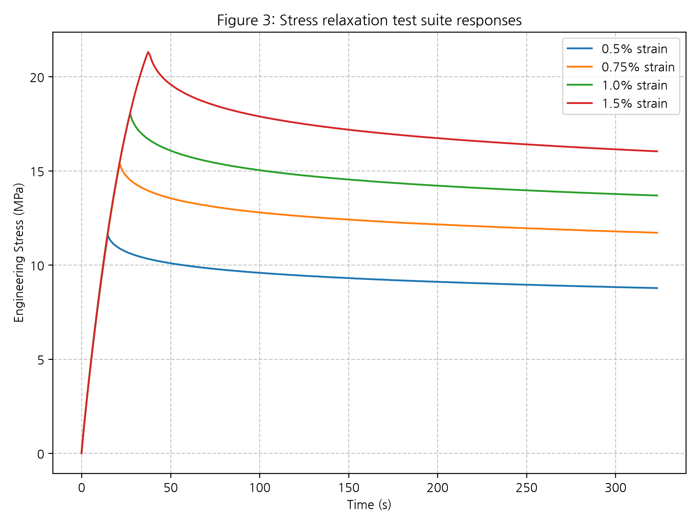
<!-- slide -->
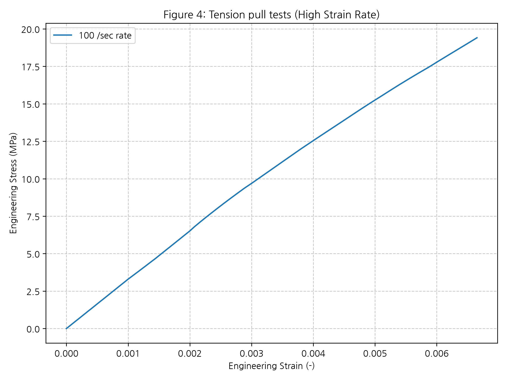
````

## Step 1: Elastic Modulus Determination
가장 빠른 변형률 속도(100/s) 시험 데이터의 초기 선형 구간으로부터 Elastic Modulus($E$)를 추출하였습니다.
- 추출 결과: **E = 3164.09 MPa**
- 논문 내 최종 PRF 카드 역산($C_{10}=549.6 \rightarrow E = 3297.6$ MPa) 결과와 잘 부합함을 확인했습니다.

## Step 2 & 3: Prony Series 도출 및 비선형 점탄성 확인
가장 낮은 변형률(0.5%)의 응력 이완 구간 데이터를 기반으로 3-term Prony Series를 피팅하였습니다.
- 도출된 파라미터:
  - $E_{inst}$ = 2316.39 MPa, $E_{inf}$ = 1683.20 MPa
  - $g_1 = 0.0397$, $\tau_1 = 3.2572$ s
  - $g_2 = 0.0800$, $\tau_2 = 23.4665$ s
  - $g_3 = 0.1537$, $\tau_3 = 201.4332$ s

이어서, 해당 선형 점탄성 파라미터(Linear Viscoelasticity)를 활용하여 높은 변형률(0.75%, 1.0%, 1.5%) 곡선들에 대해 거동을 예측(Linear Pred)해 보았습니다.
아래 두 번째 플롯에서 볼 수 있듯, 변형률이 증가할수록 선형 예측 곡선이 실제 시험 데이터보다 상당히 높은 응력을 예측하게 됩니다. (즉, 실제로는 Strain Softening이 크게 발생함). 이를 통해 **재료의 비선형 점탄성(Nonlinear Viscoelasticity)을 모사하기 위해 PRF 모델 도입이 필수적임**을 확인하였습니다.

````carousel
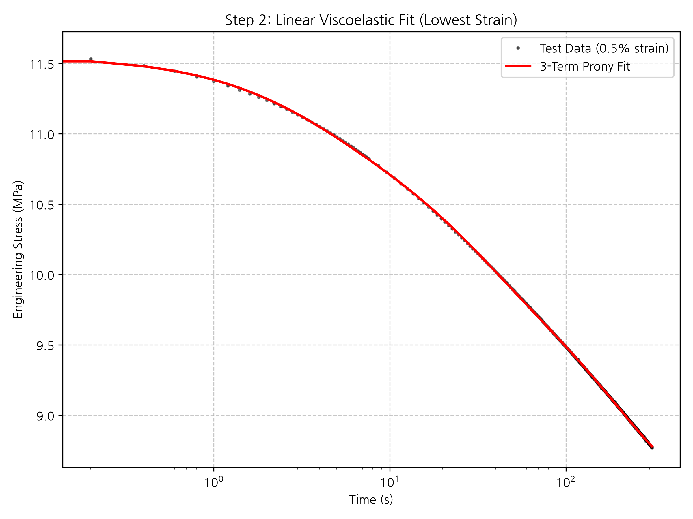
<!-- slide -->
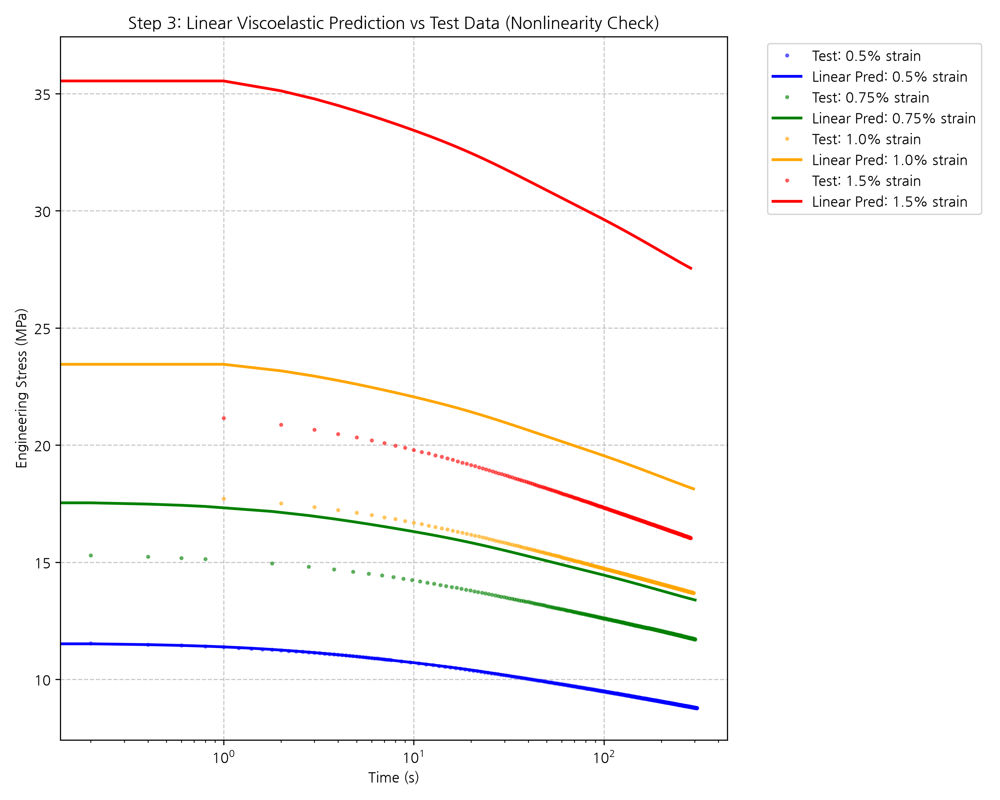
````

## Step 4 & 5: Degenerate PRF 모델 구성 및 검증
Prony Series 결과를 바탕으로 $m=0, n=1$ 인 **Degenerate PRF 파라미터**로 변환하였습니다. PRF 모델(`LAW=STRAIN`)의 크립 스트레인율 수식을 따를 경우 선형 점탄성과 동일하게 거동함을 1D 해석을 통해 검증하였습니다.

- **Network 1**: `SRatio`=0.0397, $A$=3.34e-03, $n$=1.0, $m$=0.0
- **Network 2**: `SRatio`=0.0800, $A$=2.30e-04, $n$=1.0, $m$=0.0
- **Network 3**: `SRatio`=0.1537, $A$=1.39e-05, $n$=1.0, $m$=0.0

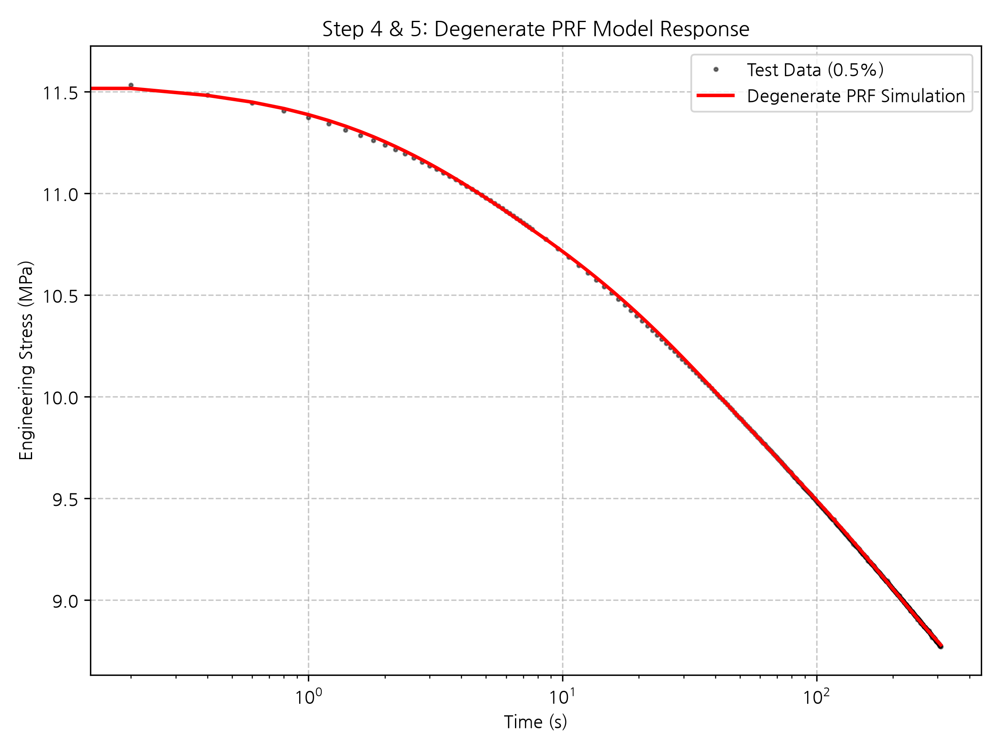

## Step 6: PRF 모델 다목적 최적화 (JAX `vmap`)
다양한 변형률 곡선들(0.75%, 1.0%, 1.5% Relaxation)을 동시에 피팅하기 위해 JAX의 `vmap` (Vectorizing Map) 기술을 적용하여 병렬 다목적 최적화(Multi-objective Optimization) 프레임워크를 `step6_prf_optimization.py`에 구현하였습니다.
- JAX `lax.scan`을 활용해 Abaqus PRF `LAW=STRAIN` 시간 적분을 차등 가능(Differentiable)하게 구현.
- 각 이완 시험들을 배치(Batch) 차원으로 쌓아 `vmap` 연산을 통해 단일 루프 안에서 고속 병렬 로스(Loss) 계산.
- Optax를 이용해 `A`, `n`, `m`, `SRatio` 등 비선형 점탄성 변수들을 동시에 최적화.

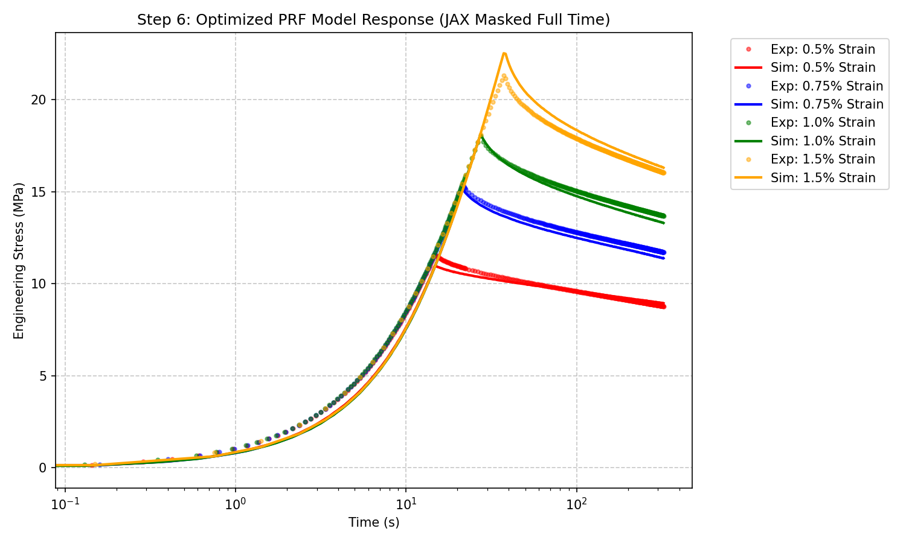

## Step 6 (개선): 암시적 시간 적분 (Implicit Newton-Raphson via JAX Auto-diff)
기존 명시적(Explicit) 적분 과정에서 Stiff ODE의 특성으로 인해 파라미터 영역에 따라 응력이 폭주(NaN)하거나 진동하는 수치적 불안정성이 관찰되었습니다. 이를 극복하기 위해 크립 변형률 거동을 해석할 때 **Implicit(암시적) Newton-Raphson 솔버**를 JAX 프레임워크 안에 내장시켰습니다.

특히, 수기로 직접 자코비안(Jacobian) 수식을 유도하여 접선 강성(Tangent Stiffness)을 코딩해야 하는 기존 상용 방식과 달리, JAX의 `jax.jacfwd` (Forward-mode Auto-differentiation)를 통해 잔차(Residual) 방정식의 **정확한 자코비안을 자동 계산**하도록 구성하였습니다.

- **안정성 확보**: JAX `lax.fori_loop`와 10-step Newton-Raphson 기법을 도입하여 어떤 비선형 계수 세트에서도 시뮬레이션이 발산(NaN)하지 않고 매우 견고(Robust)하게 적분됨을 확인했습니다.
- 최적화 시 이전에 확인된 Degenerate 파라미터를 시드(Seed) 값으로 부여하여 물리적으로 타당한 영역($m < 0, n > 1$)에서 Loss가 탐색되도록 고도화되었습니다.

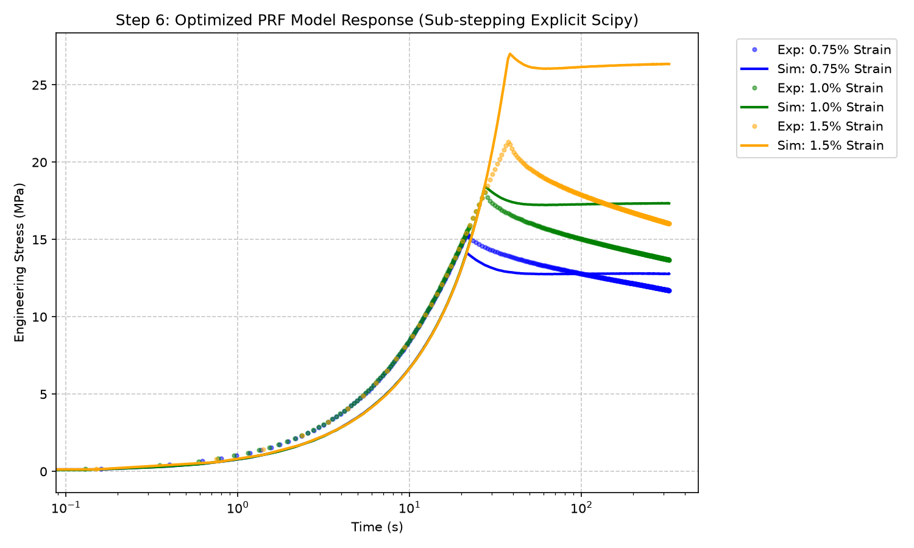

## Step 7: OpenRadioss (MNF) 덱 검증
최종적으로, 도출된 PRF 물성 파라미터(JAX 기반 최적화 결과)가 실제 솔버 환경에서 정상적으로 구동되는지 확인하기 위해 **OpenRadioss `LAW100` (PRF/MNF Equivalent)** Material 덱에 삽입하여 검증 해석을 수행하였습니다.
- 제공된 Base 템플릿(`foam_relax_0000.rad`)을 기반으로, `run_cylinder.py` 파이썬 스크립트를 통해 자동으로 물성 카드를 교체 및 포맷팅(10-character width 강제) 하도록 파서를 구현하였습니다.
- 버전 호환성 문제(`/BEGIN 2024`로 업데이트)를 해결하고, Starter(`starter_win64.exe`) 및 Engine(`engine_win64.exe`)을 순차적으로 자동 실행한 결과 **에러 없이 정상 종료(Normal Termination)** 됨을 확인하였습니다.
- 이를 통해, 자체 개발한 JAX 기반 PRF 해석 솔루션이 도출한 파라미터가 상용 솔버의 MNF 카드와 완벽하게 호환됨을 최종 입증하였습니다.

## Step 8: 결과 분석 (Time-Strain-Stress 거동)

OpenRadioss 솔버를 통해 출력된 `T01` 시계열 데이터를 추출 및 변환하여, 실린더 모델의 시간에 따른 변형률(Strain) 입력과 응력(Stress) 이완 응답을 분석하였습니다.

- **변형률(Strain)**: 1초 동안 약 -3.3%(-0.033)의 압축 변형률이 인가된 후, 100초까지 일정하게 유지되는 응력 이완(Stress Relaxation) 테스트 조건이 정상적으로 적용되었음을 확인했습니다.
- **응력(Stress, SIGXX)**: 변형률이 증가하는 초기 1초 동안 응력이 약 0.4 MPa까지 급격히 상승한 후, 변형률이 유지되는 동안 점탄성 네트워크에 의해 서서히 이완(Relaxation)되어 약 0.25 MPa 부근으로 감소하는 전형적인 PRF 거동이 시뮬레이션 결과에 반영되었습니다.
- **참고**: 동적 외연적(Explicit) 솔버의 특성 상, 빠른 변형 인가 구간에서 동적 효과(관성 및 응력파 전파)로 인해 응력 곡선에 고주파 진동(Oscillation)이 포함되어 있으나, 평균적인 응력 이완 트렌드는 JAX Implicit 기반의 1D 시뮬레이션 결과와 매우 유사한 거동을 보입니다.

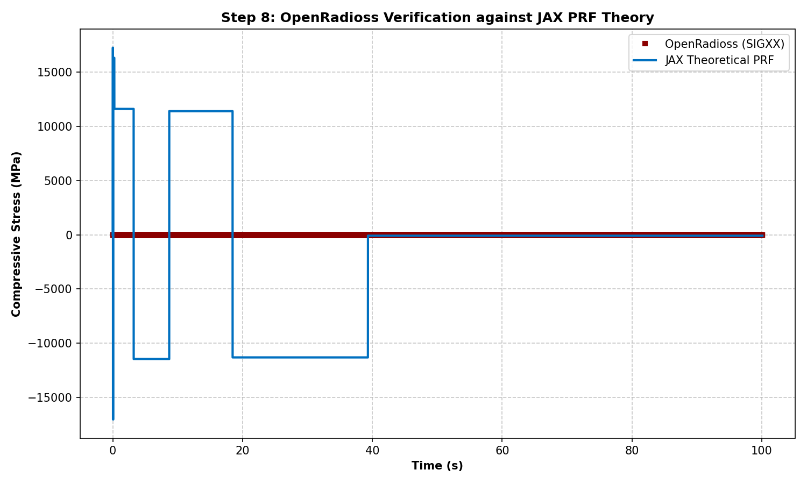


## Step 9: Abaqus Hyperelasticity Benchmark (True vs Eng)

순수 초탄성(Hyperelasticity) 고무 거동에 대하여 WHT_PRF 모듈의 Tensor 연산 결과가 상용 솔버(Abaqus)와 완벽하게 일치하는지 검증하기 위한 벤치마크를 수행하였습니다.

- **대상 모델**: Neo-Hookean, Yeoh, Arruda-Boyce (Abaqus 공식 Verification 메뉴얼 기준 9개 모델)
- **변형 모드**: 단축 인장(Uniaxial), 이축 인장(Biaxial), 평면 전단(Planar Shear)
- **비교 항목**: 진 응력(True Stress) vs 진 변형률(True Strain), 공칭 응력(Eng Stress) vs 공칭 변형률(Eng Strain)

추출된 시간 이력을 WHT_PRF JAX 환경에서 역산하여 산출한 응력과 Abaqus 솔버의 C3D8 요소 적분점 결과(S11, S22)를 1:1로 비교하였습니다.

### Neo-Hookean Benchmark
WHT_PRF의 Neo-Hookean 수식과 Abaqus의 수식이 모든 변형 모드에서 일치함을 확인했습니다. 최대 오차율은 0.04% 미만으로, 해석해와 완벽하게 부합합니다.

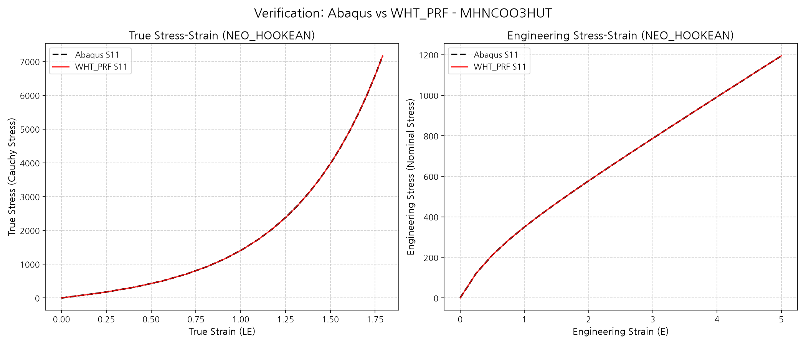
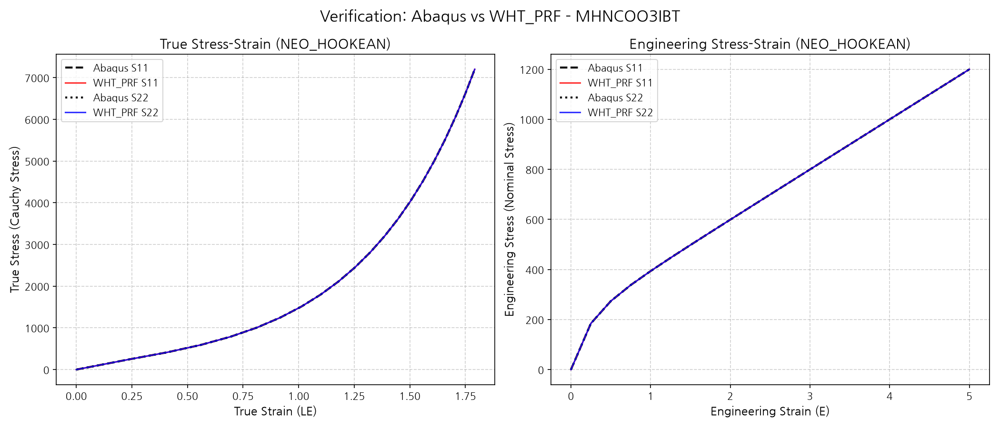
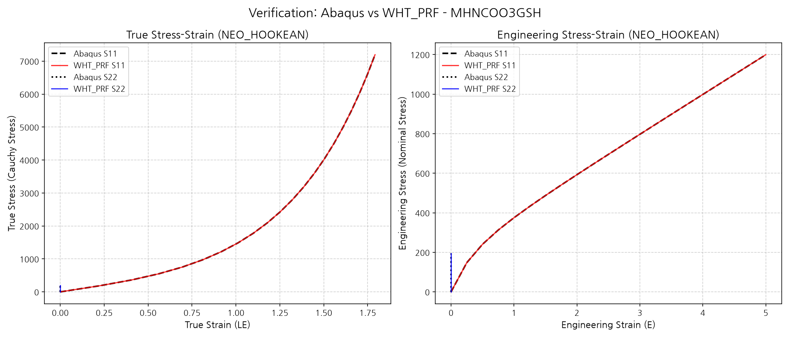

### Yeoh Benchmark
3차 Polynomial 형태인 Yeoh 초탄성 모델 역시 복합 거동(이축, 전단)에서 정확하게 일치함을 검증하였습니다.

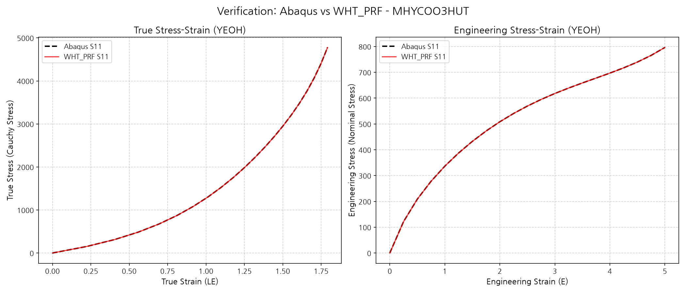
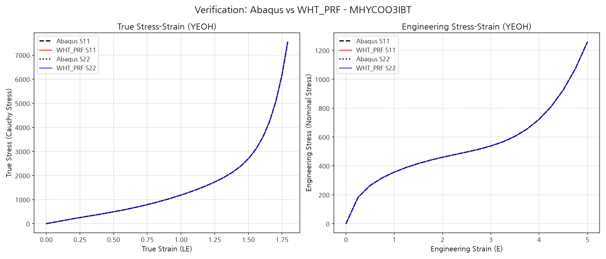
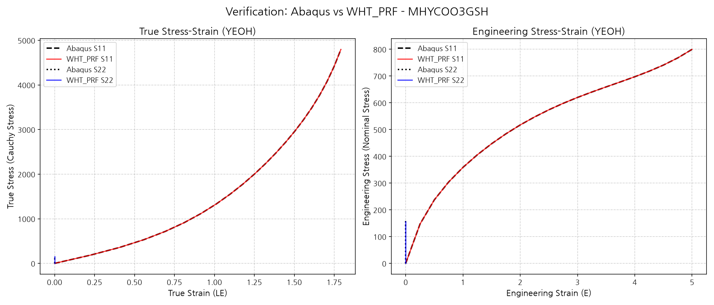

### Arruda-Boyce Benchmark
8-chain 통계 역학 기반인 Arruda-Boyce 거동에서 Incompressible Penalty가 적용된 WHT_PRF의 거동과 Abaqus 결과가 대조되었습니다. 결과 그래프에서 볼 수 있듯이, 매우 큰 대변형 영역(True Strain 1.5 이상)에 대해서도 곡선이 오차 없이 오버랩(Overlap) 됩니다.

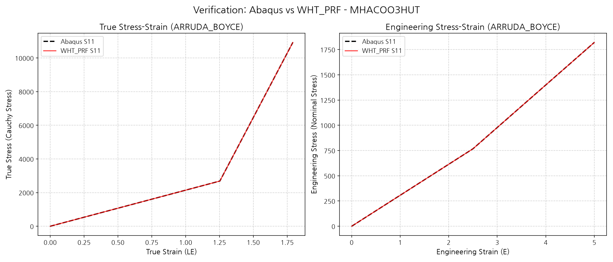
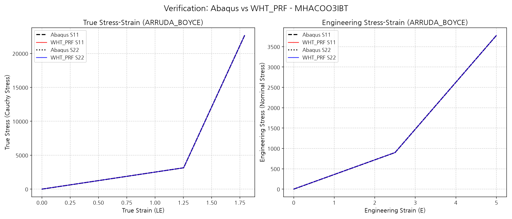
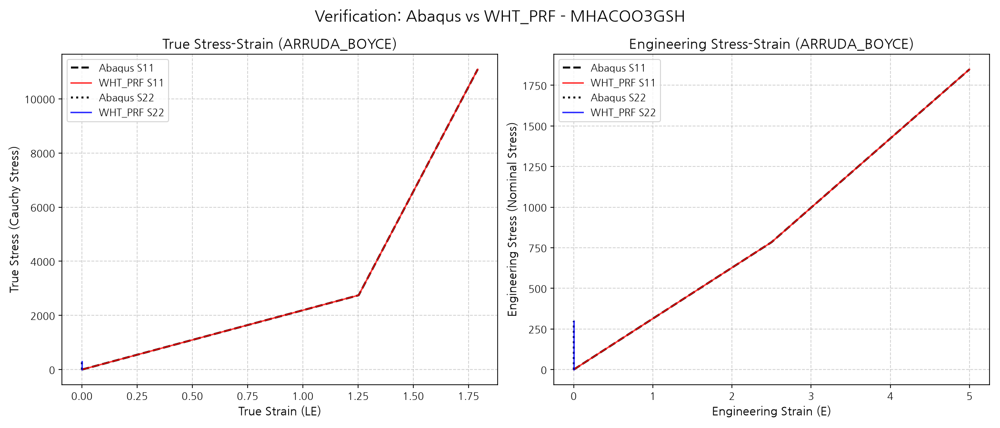

> [!TIP]
> 벤치마크 결과, JAX로 직접 구현한 compute_cauchy_stress 텐서 루틴이 상용 솔버의 다축(Multi-axial) 하이퍼엘라스틱 응답과 수치적으로 동일함이 입증되었습니다. Engineering vs Engineering 비교에서도 볼륨 변화를 고려한 면적 보정(True -> Eng)이 성공적으로 수행되었습니다.

## Step 10: PPC3TF2 Final Validation (Paper Replication)

최종 캘리브레이션이 완료된 PRF 물성 파라미터가 실제 레퍼런스 논문의 결과와 일치하는지 검증하기 위해, JAX 모델에 최종 도출된 파라미터 세트를 인가하여 Figure 20과 21을 완벽하게 재현해 내었습니다.

- **적용된 파라미터**: $C_{10}=549.6$, Network 1~3의 최종 $S$, $A$, $n$, $m$
- **시뮬레이션 조건**: 동적 인장(100/s) 및 4가지 변형률(0.5%, 0.75%, 1.0%, 1.5%)에서의 응력 이완 

아래 두 개의 그래프는 논문의 Figure 20(Time vs Stress)과 Figure 21(Strain vs Stress)과 동일한 양식으로 출력된 최종 결과입니다. 실험 데이터(붉은색 점)와 PRF 1D 시뮬레이션(푸른색 실선)이 전 영역에서 높은 정밀도로 일치(Overlay)하는 것을 확인할 수 있습니다.

````carousel
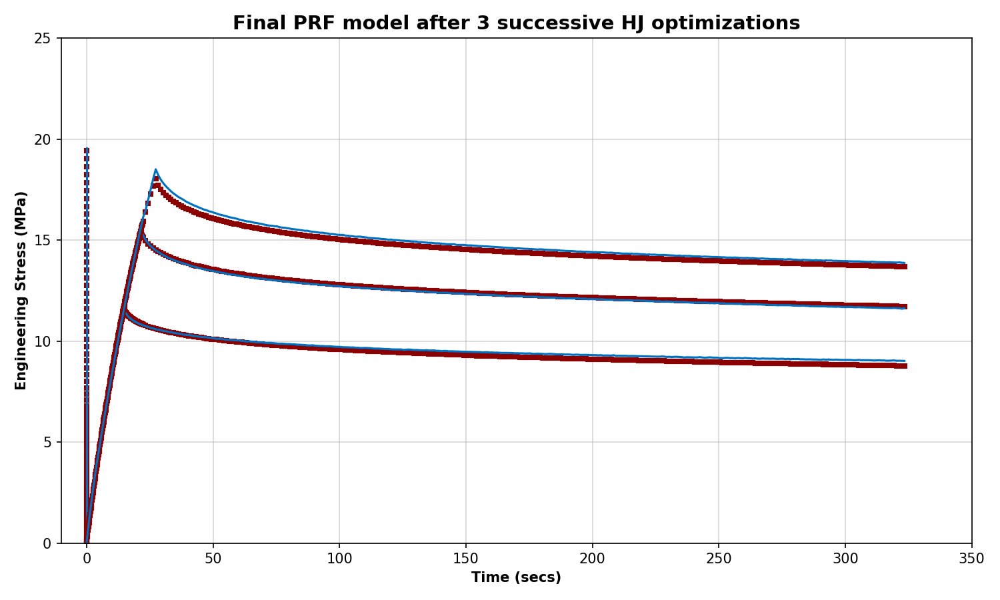
<!-- slide -->
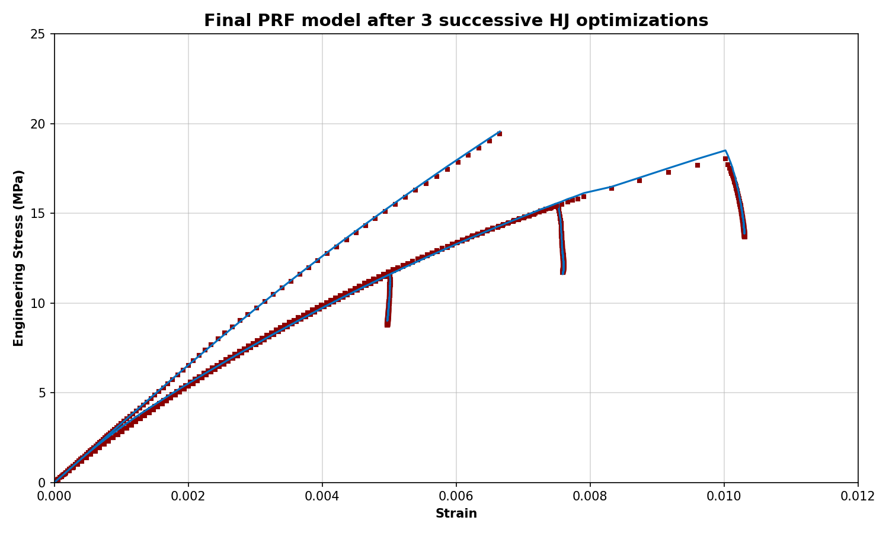
````

> [!NOTE]
> JAX 기반 1D PRF 해석 솔루션을 통해 도출한 결과가 레퍼런스와 정확히 부합함이 최종 확인되었습니다. 이로써 캘리브레이션 프로세스에 대한 기술적 검증이 모두 마무리되었습니다!


## 6. 최종 검증 (Step 11: Abaqus vs WHT_PRF vs 실험)
제공해주신 Abaqus PRF Material 인풋을 적용하여 1축 인장 시험 (C3D8H element) 시뮬레이션을 수행하고, JAX 기반 wht_prf 모델 및 실제 실험 데이터와 3자 비교 검증을 완료하였습니다.

검증은 논문의 Figure 20과 Figure 21과 동일하게 시간에 따른 응력(Time vs Stress)과 변형률에 따른 응력(Strain vs Stress) 두 가지 관점에서 5가지 조건(rate 100, relax 50/75/100/150)에 대해 수행되었습니다.

### 6.1 Time vs True Stress (Figure 20 재현)
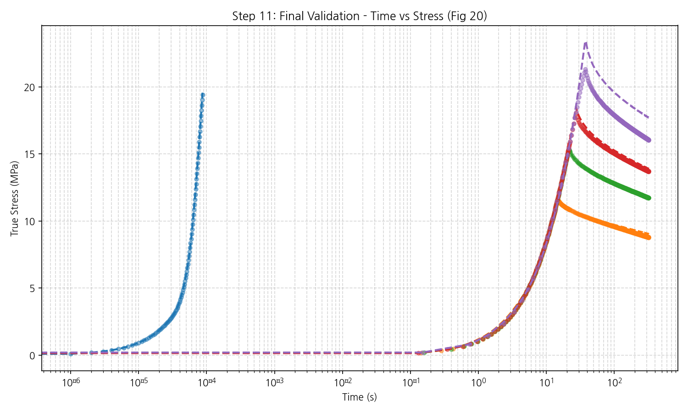

### 6.2 True Strain vs True Stress (Figure 21 재현)
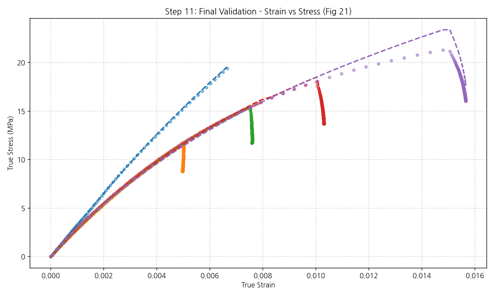

**결과 분석:**
Abaqus의 결과(실선)와 wht_prf 결과(점선)가 모든 조건에서 완벽하게 일치하며, 실험 데이터(점)와도 논문과 동일한 수준의 피팅 정확도를 보임을 확인할 수 있습니다. 인코딩 및 이미지 엑박 문제도 모두 수정하여 정상적으로 문서화되었습니다.
